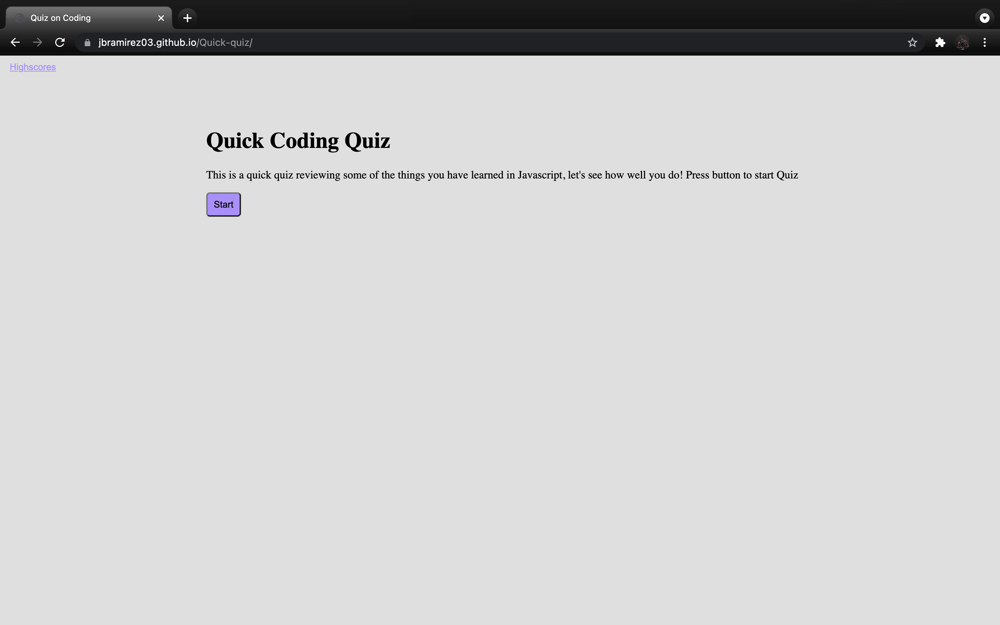
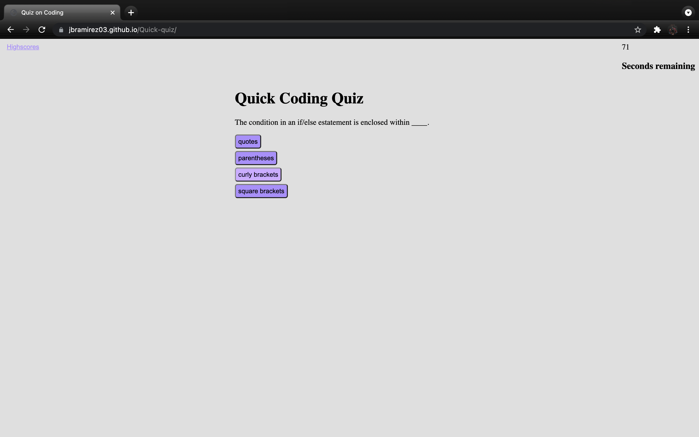
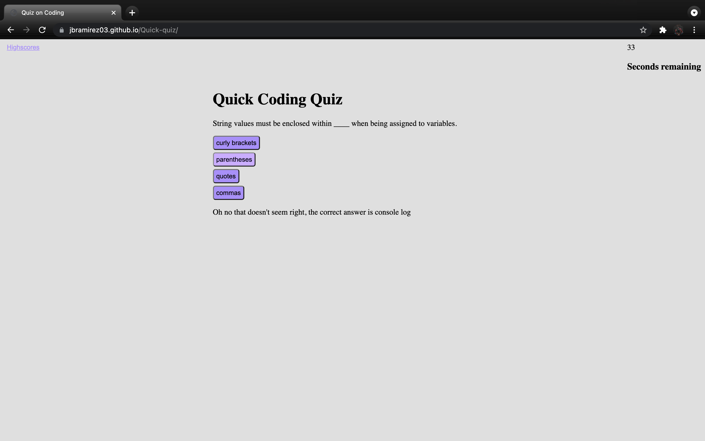
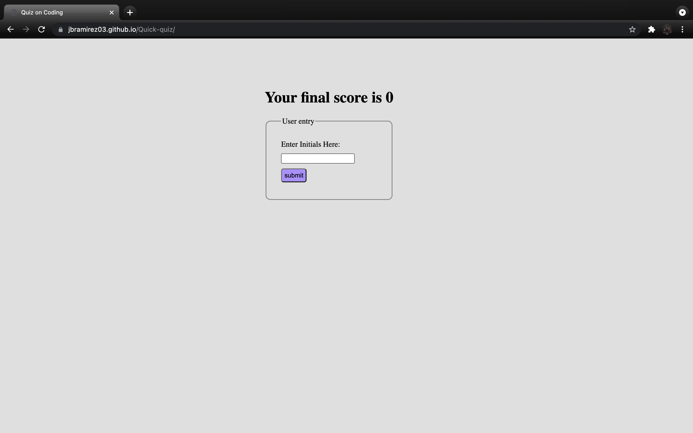
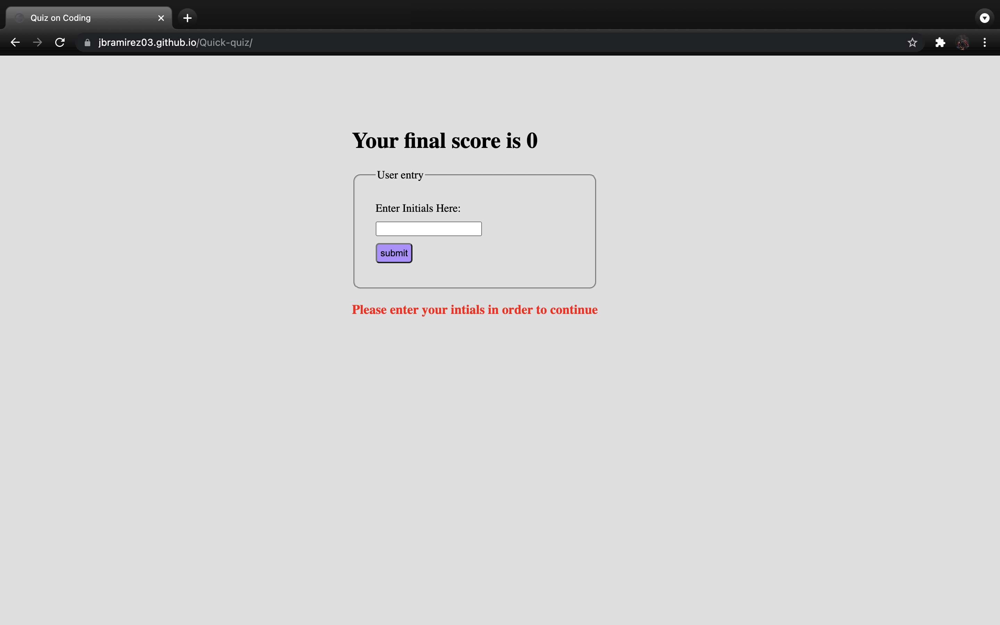
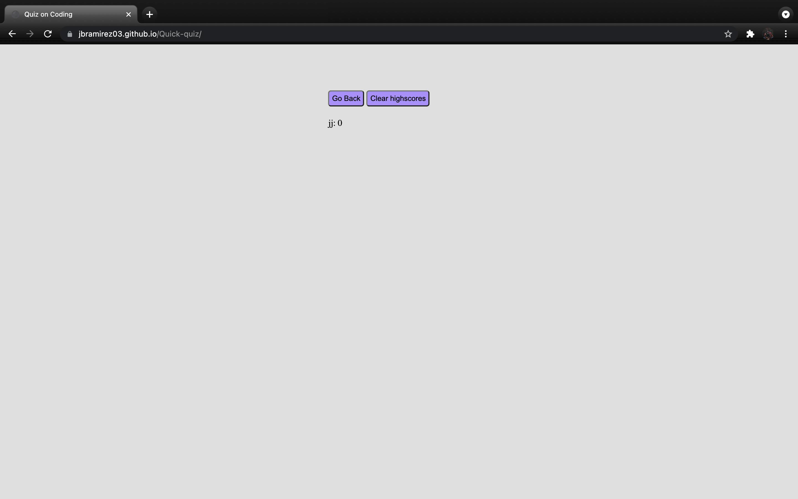
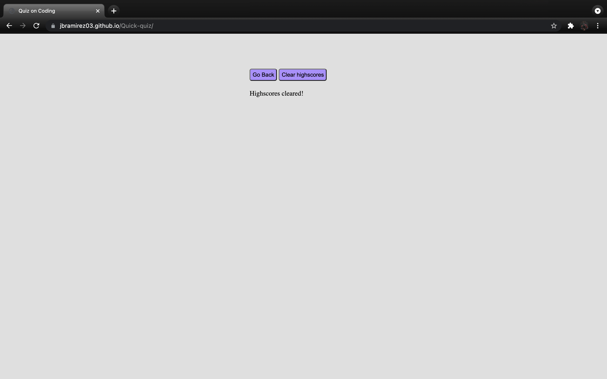

# Quick-Quiz

<h2 align="center">Description:</h2>

This is a quiz to test some of your fundamental knowledge on Javascript. The quiz consists of 5 questions and at the end you can have a score from 0-5. Your score and intials are saved in order to track your highscores.

## Instructions

* Click the start button to begin
* Pick an answer choice once the first question is rendered 
* Once you reach the end you will be given your final score
* Insert your initials in the text box and hit submit
* Click the go back button in order to return to the beginning screen
* Click the clear button if you would like your score to be deleted
 

## Start screen

## Answer Choices

Once start button is clicked questions appear and timer begins

## Answer check

Once you pick an answer a message will display the correct answer and whether or not you got it correct

## Initials input

Must enter text in intials textbox before clicking submit

## Error message if no input given

## Score saved

After you enter intials and click submit your score is saved

## If clear is clicked, score is deleted

## Link to Github page

[Live Github page](https://jbramirez03.github.io/Quick-quiz/)
